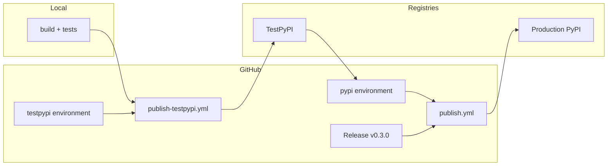

# Publish privysha to PyPI (v0.3.0)

## Current state

The project is **packaging-ready**:

- Package name: `privysha`, version `0.3.0` (consistent in [`pyproject.toml`](pyproject.toml), [`src/privysha/__init__.py`](src/privysha/__init__.py), [`CHANGELOG.md`](CHANGELOG.md))
- Build backend: setuptools (`src/` layout)
- Workflows already exist:
  - [`/.github/workflows/publish-testpypi.yml`](.github/workflows/publish-testpypi.yml) — manual dispatch → TestPyPI
  - [`/.github/workflows/publish.yml`](.github/workflows/publish.yml) — GitHub release (or manual dispatch) → production PyPI
- Detailed reference: [`docs/publishing.md`](docs/publishing.md)

You have PyPI/TestPyPI accounts but **trusted publishers are not configured yet**. No API tokens need to be stored in GitHub — OIDC handles auth.



---

## Phase 1 — Local pre-flight (Windows)

Run locally before touching PyPI. Mirrors CI gates in both publish workflows.

```powershell
cd d:\Projects\privySHA\project
python -m venv .venv
.\.venv\Scripts\Activate.ps1
pip install -e ".[dev]"
pip install build twine
pytest tests_v2/ tests/ -m "not slow"
python benchmarks/run_benchmarks.py
python benchmarks/run_benchmarks.py --compare benchmarks/baseline/results.json
python -m build
twine check dist/*
pip install dist/*.whl --force-reinstall
python -c "from privysha import process; print(process('hello'))"
```

**Pass criteria:** tests green, benchmarks match baseline, `twine check` passes, wheel installs and imports cleanly.

If benchmarks fail due to intentional changes, update baseline per [`docs/publishing.md`](docs/publishing.md):

```powershell
python benchmarks/run_benchmarks.py --save --update-baseline
```

Push any baseline updates to `main` and confirm CI is green.

---

## Phase 2 — One-time TestPyPI trusted publishing setup

### 2a. GitHub environment

In **GitHub repo → Settings → Environments**:

- Create environment: `testpypi`
- Optional: add protection rules (not required for TestPyPI)

### 2b. TestPyPI pending publisher

Log in to [test.pypi.org](https://test.pypi.org/) → **Account settings → Publishing → Add a new pending publisher**:

| Field | Value |
|-------|-------|
| PyPI project name | `privysha` |
| Owner | `AjayRajan05` |
| Repository name | `privySHA` |
| Workflow name | `publish-testpypi.yml` |
| Environment name | `testpypi` |

**Exact string match matters** — a typo in owner, repo, workflow, or environment name causes auth failure.

> Note: If [test.pypi.org/project/privysha](https://test.pypi.org/project/privysha/) already exists under a different account, either log in as that owner or get added as **Maintainer** before publishing.

---

## Phase 3 — Publish and verify on TestPyPI

1. Push latest `main` to GitHub (if not already).
2. **Actions → Publish to TestPyPI → Run workflow**
   - Branch: `main`
   - Skip tests: `false` (default)
3. Watch the job — it runs tests, benchmarks, build, `twine check`, smoke install, then uploads via OIDC.
4. Confirm package page: [test.pypi.org/project/privysha](https://test.pypi.org/project/privysha/)
5. Clean install test (fresh venv recommended):

```powershell
pip install --index-url https://test.pypi.org/simple/ --extra-index-url https://pypi.org/simple/ privysha==0.3.0
python -c "from privysha import process; print(process('hello'))"
privysha --help
```

The `--extra-index-url https://pypi.org/simple/` is required because TestPyPI does not mirror dependencies like `pydantic`.

---

## Phase 4 — One-time production PyPI trusted publishing setup

Repeat the same pattern for production.

### 4a. GitHub environment

Create environment: `pypi`

- Recommended: enable **Required reviewers** so production uploads need approval

### 4b. PyPI pending publisher

Log in to [pypi.org](https://pypi.org/) → open project `privysha` (or it will be created on first successful upload) → **Publishing → Add a new pending publisher**:

| Field | Value |
|-------|-------|
| PyPI project name | `privysha` |
| Owner | `AjayRajan05` |
| Repository name | `privySHA` |
| Workflow name | `publish.yml` |
| Environment name | `pypi` |

---

## Phase 5 — Production release (triggers publish)

The production workflow ([`publish.yml`](.github/workflows/publish.yml)) triggers on **release published** (or manual `workflow_dispatch`).

1. Confirm TestPyPI install works and CI on `main` is green.
2. **GitHub → Releases → Draft a new release**
   - Tag: `v0.3.0` (must match semver in `pyproject.toml`)
   - Target: `main`
   - Title: e.g. `PrivySHA 0.3.0 — Developer Preview`
   - Body: copy from [`CHANGELOG.md`](CHANGELOG.md) `[0.3.0]` section; link to [`docs/developer-preview.md`](docs/developer-preview.md)
3. Click **Publish release**
4. If `pypi` environment has reviewers, approve the pending deployment when prompted.
5. Monitor **Actions → Publish to PyPI** until upload succeeds.

---

## Phase 6 — Post-publish verification

1. Confirm [pypi.org/project/privysha](https://pypi.org/project/privysha/) shows v0.3.0
2. Clean install from production:

```powershell
pip install privysha==0.3.0
python -c "from privysha import process; print(process('hello'))"
```

3. Optional extras smoke test: `pip install "privysha[openai]"` or `"privysha[integrations]"`
4. Announce using the draft in [`docs/developer-preview.md`](docs/developer-preview.md)

---

## Troubleshooting quick reference

| Symptom | Likely cause | Fix |
|---------|--------------|-----|
| OIDC / trusted publishing error in Actions | Publisher config mismatch | Re-check all 5 fields in PyPI pending publisher vs workflow/environment names |
| `403 Forbidden` on manual twine upload | Wrong token or account | Use TestPyPI token from test.pypi.org; ensure you own or maintain the project |
| Benchmark step fails in CI | Local vs baseline drift | Re-run locally; update baseline if change is intentional |
| `File already exists` on re-upload | Same version already published | Bump version in `pyproject.toml`, `__init__.py`, `CHANGELOG.md`, and use new tag |
| Tag/version mismatch | Release tag ≠ pyproject version | Always tag `v0.3.0` when version is `0.3.0` |

---

## Future releases checklist

For each subsequent version (0.3.1, 0.4.0, …):

1. Bump version in [`pyproject.toml`](pyproject.toml) and [`src/privysha/__init__.py`](src/privysha/__init__.py)
2. Add [`CHANGELOG.md`](CHANGELOG.md) entry
3. Merge to `main`, CI green
4. Optional: re-run TestPyPI workflow
5. Create GitHub release with matching tag → production publish is automatic

Trusted publisher setup is **one-time** — you do not repeat Phases 2 and 4 for future releases.
