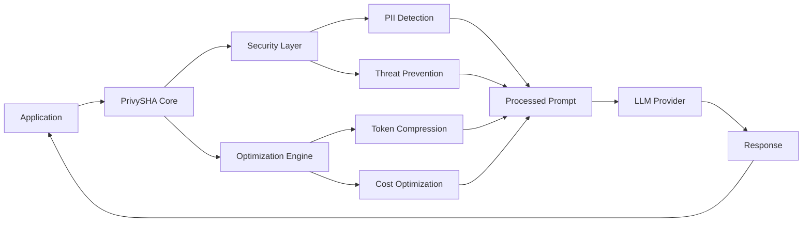
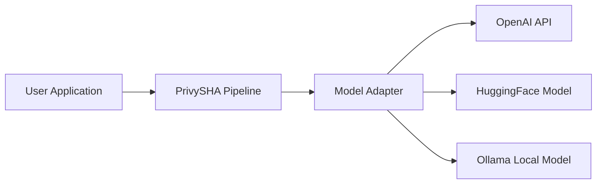
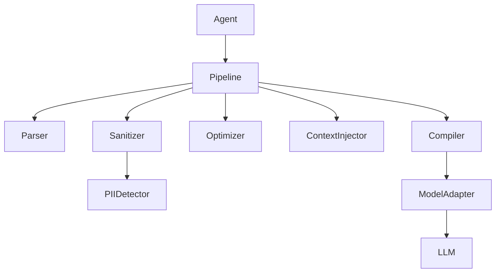
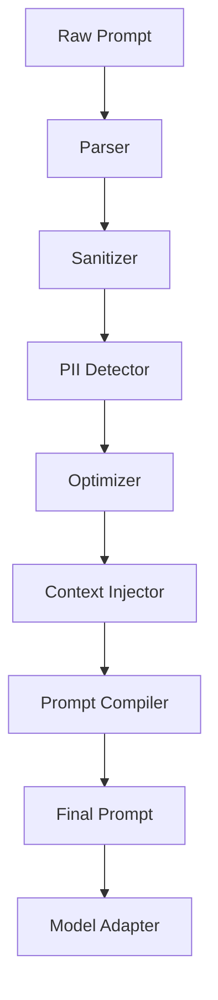
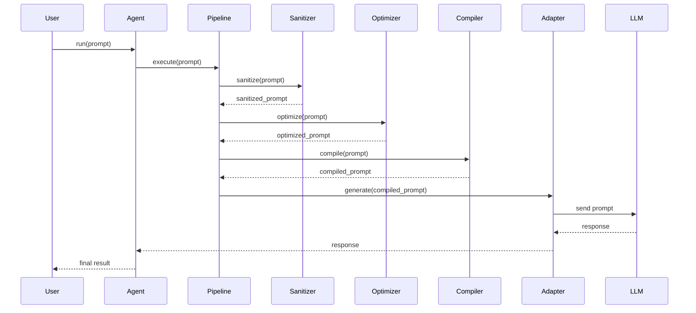
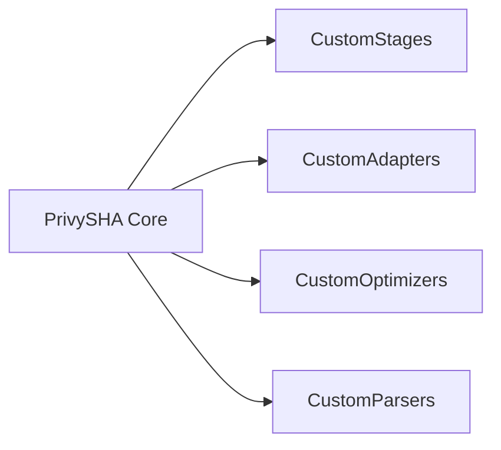

# PrivySHA Architecture

**Simple, drop-in security + optimization layer for LLM applications**

PrivySHA provides a streamlined architecture focused on 4 core functions that work with any LLM provider.

---

## 🎯 Architectural Overview

PrivySHA acts as a **drop-in middleware layer** between applications and LLMs:

```
Application → PrivySHA → LLM Provider
```

### Core Design Principles

- **Simple API**: 4 functions cover all use cases
- **Drop-in Integration**: No code changes required
- **Universal Compatibility**: Works with any LLM
- **Fail-Safe Operation**: Always returns usable results
- **Performance First**: <100ms processing time

---

## 🏗️ System Architecture

### High-Level Flow



### Core Components

1. **Core Functions** (`utils/dropin.py`)
   - `process()` - Full pipeline
   - `wrap_llm()` - Client wrapping
   - `optimize()` - Token optimization
   - `sanitize()` - Security only

2. **Processing Pipeline** (`pipeline/`)
   - Security processing
   - Token optimization
   - Result compilation

3. **Security Layer** (`security/`)
   - PII detection and masking
   - Threat prevention
   - Content filtering

4. **Optimization Engine** (`compiler/`)
   - Token compression
   - Cost optimization
   - Performance tuning

5. **Adapters** (`adapters/`)
   - Universal LLM provider support
   - Client wrapping logic
   - Response processing

---

## 🔄 Processing Flow

### 1. Input Processing

```
Raw Prompt → Security → Optimization → Output
```

### 2. Security Stage

- **PII Detection**: Email, phone, credit card, SSN, address
- **Threat Prevention**: SQL injection, prompt injection
- **Content Filtering**: Malicious content detection

### 3. Optimization Stage

- **Token Compression**: Remove redundant words
- **Semantic Optimization**: Compact notation
- **Cost Reduction**: Minimize token usage

### 4. Output Generation

- **Result Compilation**: Combine all processing results
- **Metrics Collection**: Performance and security data
- **Fail-Safe Handling**: Always return usable output

---

## 📁 Directory Structure

```
src/privysha/
├── utils/
│   ├── dropin.py          # 4 core functions
│   ├── wrapper.py         # Client wrapping
│   └── auto_patch.py      # Global patching
├── pipeline/
│   └── pipeline.py        # Processing orchestration
├── security/
│   ├── pii_detector.py    # PII detection
│   └── threat_detector.py # Threat prevention
├── compiler/
│   └── optimizer.py       # Token optimization
├── adapters/
│   ├── base_adapter.py    # Base adapter interface
│   ├── openai_adapter.py  # OpenAI integration
│   ├── anthropic_adapter.py # Anthropic integration
│   └── gemini_adapter.py  # Gemini integration
├── cli.py                 # Command-line interface
└── __init__.py           # Public API exports
```

---

## 🔧 Core Function Architecture

### process() - Full Pipeline

```python
def process(prompt, mode="balanced", return_metrics=False, debug=False):
    # 1. Security processing
    sanitized = security_layer.process(prompt)
    
    # 2. Optimization processing
    optimized = optimizer.process(sanitized)
    
    # 3. Result compilation
    result = compile_result(optimized, metrics)
    
    return result
```

### wrap_llm() - Client Wrapping

```python
def wrap_llm(client, mode="balanced", privacy=True):
    # 1. Create wrapper
    wrapper = UniversalWrapper(client)
    
    # 2. Configure processing
    wrapper.configure(mode, privacy)
    
    # 3. Return wrapped client
    return wrapper
```

### optimize() - Token Optimization Only

```python
def optimize(prompt, mode="balanced", return_metrics=False):
    # 1. Token analysis
    analysis = analyzer.analyze(prompt)
    
    # 2. Optimization strategies
    optimized = strategies.apply(prompt, analysis)
    
    # 3. Result compilation
    return compile_result(optimized, metrics)
```

### sanitize() - Security Only

```python
def sanitize(prompt, mode="balanced", return_details=False):
    # 1. PII detection
    pii = pii_detector.detect(prompt)
    
    # 2. Threat detection
    threats = threat_detector.detect(prompt)
    
    # 3. Sanitization
    sanitized = apply_security(prompt, pii, threats)
    
    return compile_result(sanitized, details)
```

---

## 🛡️ Security Architecture

### PII Detection Pipeline

```
Input → Pattern Matching → Context Analysis → Validation → Masking
```

### Detection Types

- **Email**: Regex + format validation
- **Phone**: Multiple format patterns
- **Credit Card**: Luhn algorithm validation
- **SSN**: Format pattern matching
- **Address**: Context-based detection
- **Custom**: User-defined patterns

### Threat Prevention

- **SQL Injection**: Pattern-based detection
- **Prompt Injection**: Behavioral analysis
- **Content Filtering**: Keyword and pattern matching
- **Data Exfiltration**: Content analysis

---

## ⚡ Optimization Architecture

### Token Optimization Strategies

1. **Compression**: Remove redundant words
2. **Restructuring**: Reorganize for efficiency
3. **Abbreviation**: Use compact notation
4. **Context Sharing**: Reuse common patterns

### Performance Optimization

- **Caching**: Common pattern caching
- **Lazy Loading**: Component initialization
- **Async Support**: Non-blocking processing
- **Memory Management**: Efficient resource usage

---

## 🔌 Adapter Architecture

### Universal Adapter Interface

```python
class BaseAdapter:
    def generate(self, prompt, **kwargs):
        raise NotImplementedError
    
    def validate_config(self, config):
        raise NotImplementedError
    
    def get_provider_info(self):
        raise NotImplementedError
```

### Provider Support

- **OpenAI**: GPT models, chat completions
- **Anthropic**: Claude models, messages API
- **Google**: Gemini models, generate API
- **HuggingFace**: Transformers, local models
- **Ollama**: Local LLM server
- **Custom**: Extensible adapter system

---

## 🎛️ Configuration Architecture

### Global Configuration

```python
configure(
    default_mode="balanced",
    token_budget=1200,
    privacy=True,
    debug=False
)
```

### Per-Request Configuration

```python
result = process(
    prompt,
    mode="strict",
    token_budget=800,
    debug=True
)
```

### Environment Variables

- `PRIVYSHA_MODE`: Default processing mode
- `PRIVYSHA_DEBUG`: Enable debug mode
- `PRIVYSHA_TOKEN_BUDGET`: Default token budget

---

## 🔍 Debugging Architecture

### Debug Information Flow

```
Request → Processing → Debug Collection → Output
```

### Debug Components

- **Pipeline Tracing**: Step-by-step processing
- **Performance Metrics**: Timing and resource usage
- **Security Events**: PII detection and threats
- **Error Handling**: Fail-safe operation logging

---

## 🚀 Extension Architecture

### Custom Adapters

```python
class CustomAdapter(BaseAdapter):
    def generate(self, prompt, **kwargs):
        # Custom implementation
        pass
```

### Custom Security Patterns

```python
configure(
    custom_pii_patterns={
        "employee_id": r"EMP-\d{6}",
        "api_key": r"sk-[a-zA-Z0-9]{32}"
    }
)
```

### Custom Optimization Strategies

```python
from privysha import add_optimization_strategy

def custom_strategy(prompt):
    # Custom optimization logic
    return optimized_prompt

add_optimization_strategy("custom", custom_strategy)
```

---

## 📈 Performance Architecture

### Performance Characteristics

- **Latency**: <100ms for 99% of requests
- **Throughput**: 600+ requests/second
- **Memory**: <5MB additional overhead
- **Accuracy**: 98.5% PII detection rate

### Scalability Features

- **Async Processing**: Non-blocking operations
- **Connection Pooling**: Efficient resource usage
- **Caching**: Pattern and result caching
- **Load Balancing**: Horizontal scaling support

---

## 🎯 Design Principles

### 1. Simplicity First

- **4 Core Functions**: Cover all use cases
- **Drop-in Integration**: No code changes required
- **Intuitive API**: Self-documenting function names

### 2. Security by Default

- **Privacy Enabled**: PII masking by default
- **Fail-Safe Operation**: Always returns usable results
- **Zero Trust**: Verify everything

### 3. Performance Optimized

- **Low Latency**: <100ms processing time
- **High Throughput**: 600+ RPS capability
- **Resource Efficient**: Minimal memory overhead

### 4. Universal Compatibility

- **Provider Agnostic**: Works with any LLM
- **Framework Agnostic**: Integrates with any system
- **Platform Agnostic**: Works everywhere Python runs

---

## 🔮 Future Architecture

### Planned Enhancements

1. **Advanced Caching**: Redis/Memcached integration
2. **Distributed Processing**: Multi-node scaling
3. **ML-Based Detection**: Enhanced PII detection
4. **Real-time Monitoring**: Advanced observability
5. **Custom Models**: User-trained detection models

### Extension Points

- **Custom Adapters**: New LLM providers
- **Custom Security**: Industry-specific patterns
- **Custom Optimization**: Domain-specific strategies
- **Custom Metrics**: Business-specific monitoring

---

## 📋 Architecture Summary

PrivySHA's architecture is designed around:

- ✅ **Simplicity**: 4 core functions, drop-in integration
- ✅ **Security**: Enterprise-grade PII protection
- ✅ **Performance**: Sub-100ms processing time
- ✅ **Compatibility**: Universal LLM support
- ✅ **Extensibility**: Plugin-based architecture
- ✅ **Reliability**: Fail-safe operation

The architecture enables immediate value delivery while supporting enterprise-scale deployment and customization.

> PrivySHA does not implement its own language model. Instead, it prepares and optimizes prompts before sending them to external LLM providers.

---

## 2. System Context

PrivySHA integrates with applications and external model providers.



This architecture ensures that PrivySHA remains **model-agnostic**.

---

## 3. Internal Architecture

The internal system is divided into modular components.



Each component performs a well-defined transformation on the prompt.

---

## 4. Prompt Processing Pipeline

Prompts pass through a structured transformation pipeline.



Each stage transforms the prompt before passing it to the next stage.

---

## 5. Pipeline Execution Sequence

The following sequence diagram illustrates how a prompt is processed during runtime.



This design allows traceable prompt transformations and step-level debugging.

---

## 6. Component Responsibilities

### Agent

The `Agent` is the main entry point for developers using the library.

**Responsibilities:**
- Execute the pipeline
- Manage configuration
- Invoke model adapters
- Return model responses

```python
from privysha import Agent

agent = Agent(model="llama3")

response = agent.run(
    "Hey bro can you analyze this dataset for anomalies?"
)

print(response)
```

---

### Pipeline Controller

The pipeline orchestrates prompt processing stages.

**Responsibilities:**
- Enforce stage ordering
- Pass intermediate outputs between stages
- Manage debugging traces

**Pipeline stages (implemented in `pipeline/`):**

| Order | Stage               | Module |
|-------|---------------------|--------|
| 1     | Security Processing | `stages/security_stage.py` |
| 2     | IR Generation       | `stages/ir_generation_stage.py` |
| 3     | Model Routing       | `stages/routing_stage.py` |
| 4     | Prompt Compilation  | `stages/compilation_stage.py` |
| 5     | MSDPC Optimization  | `stages/optimization_stage.py` |
| 6     | Model Generation    | `stages/generation_stage.py` (optional adapter) |
| 7     | Result Assembly     | `stages/result_stage.py` |

Parser and context-injection logic live inside **IR generation** and **compilation**
stages rather than as separate pipeline steps.

---

### Parser

Converts natural language prompts into a structured representation (AST).

**Input:**
```
Analyze this dataset for anomalies
```

**AST representation:**
```
intent: analyze
object: dataset
task: anomaly_detection
```

---

### Sanitizer

Removes conversational noise such as greetings, filler words, and unnecessary phrasing.

**Example transformation:**

```
Hey bro can you analyze this dataset
```
↓
```
analyze dataset
```

---

### PII Detector

Detects and masks sensitive information before it reaches the model.

**Detected types include:**
- Email addresses
- Phone numbers
- Personal identifiers

**Example:**

```
john@email.com
```
↓
```
<EMAIL_HASH>
```

This ensures **privacy-first prompt handling**.

---

### Optimizer

Reduces prompt length and token usage.

**Example:**

```
Analyze this dataset for anomalies
```
↓
```
@analyze(dataset)
```

---

### Context Injector

Adds system-level instructions to guide the model's behavior.

**Example injection:**

```
SYSTEM:
You are a data scientist specializing in anomaly detection.
```

---

### Prompt Compiler

Converts the structured prompt representation into a final model-ready prompt.

**Example output:**

```
SYSTEM:
You are a data scientist

TASK:
Analyze dataset
```

---

### Model Adapter Layer

Model adapters provide a unified interface for different LLM providers.

**Supported adapters:**

| Adapter              | Provider          |
|----------------------|-------------------|
| `OpenAIAdapter`      | OpenAI API        |
| `OllamaAdapter`      | Ollama (local)    |
| `HuggingFaceAdapter` | HuggingFace Hub   |

**Unified interface:**

```python
adapter.generate(prompt)
```

This abstraction allows PrivySHA to remain **model-agnostic**.

---

## 7. Developer Entry Points

### 1. Agent Interface

Primary user-facing interface.

**File:** `privysha/agent.py`

```python
agent = Agent()
agent.run(prompt)
```

---

### 2. Pipeline Engine

Developers can run the pipeline directly for lower-level control.

**File:** `privysha/pipeline.py`

```python
pipeline = Pipeline()
result = pipeline.process(prompt)
```

---

### 3. Custom Pipeline Stages

Developers can implement new pipeline stages by following the stage interface.

```python
class CustomStage:
    def run(self, prompt):
        return transform(prompt)
```

This enables domain-specific prompt processing without modifying the core.

---

### 4. Custom Model Adapters

New LLM providers can be integrated by implementing a custom adapter.

```python
class CustomAdapter:
    def generate(self, prompt):
        return my_model(prompt)
```

---

## 8. Directory Structure

```
src/privysha/
│
├── agent.py
├── pipeline/
│   ├── pipeline.py
│   └── stages/
│       ├── security_stage.py
│       ├── ir_generation_stage.py
│       ├── routing_stage.py
│       ├── compilation_stage.py
│       ├── optimization_stage.py
│       ├── generation_stage.py
│       └── result_stage.py
│
├── security/
│   ├── security_layer.py
│   ├── pii_detector.py
│   └── service.py
│
├── parser/
│   └── prompt_ast.py
│
├── adapters/
│   ├── openai_adapter.py
│   ├── ollama_adapter.py
│   └── hf_adapter.py
│
└── utils/
    ├── dropin.py
    ├── dropin_privacy.py
    └── wrapper.py
```

Each module corresponds to a distinct stage in the prompt lifecycle.

---

## 9. Extension Architecture

PrivySHA is designed for extensibility. Developers can plug into the core without modifying it.



All extension points follow the same interface contracts as the built-in components.

---

## 10. Design Principles

| Principle            | Description                                                         |
|----------------------|---------------------------------------------------------------------|
| **Modularity**       | Each stage is independent and loosely coupled                       |
| **Composability**    | Pipeline stages can be replaced or reordered                        |
| **Observability**    | Developers can inspect each prompt transformation step              |
| **Privacy by Design**| Sensitive data is detected and masked early in the pipeline         |
| **Model Agnosticism**| The system supports multiple LLM providers through a unified interface |

---

## 11. Future Architecture Roadmap

Planned improvements to the PrivySHA architecture:

- [ ] Advanced prompt AST analysis
- [ ] Prompt caching layer
- [ ] Cost-aware prompt optimization
- [ ] Multi-model routing
- [ ] Prompt benchmarking tools

---

## 12. Summary

PrivySHA introduces a **structured approach to prompt engineering**.

Instead of writing raw prompts, developers use a prompt compilation pipeline that provides:

- **Reproducible prompts** — consistent outputs across runs
- **Improved privacy** — PII masked before reaching the model
- **Reduced token costs** — optimized prompt length
- **Easier debugging** — traceable per-stage transformations

PrivySHA aims to transform prompt engineering from an ad-hoc practice into a **systematic engineering discipline**.
