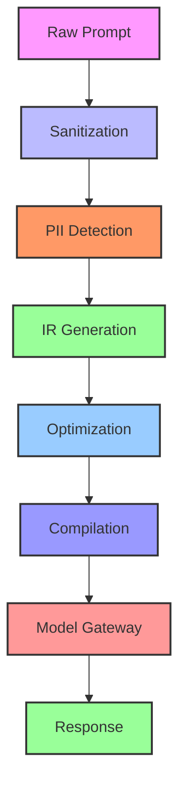

# Debugging

**Debug and monitor PrivySHA's 4 core functions**

PrivySHA provides comprehensive debugging capabilities to help you understand how prompts are processed and optimized.

---

## Tracing: `TraceContext` vs `DebugTracer`

| API | Status | Use when |
|-----|--------|----------|
| **`TraceContext`** (`trace=True` on `process()`) | **Recommended** | Production tracing, JSON logs, stage latency, diffs |
| **`DebugTracer`** (`from privysha import DebugTracer`) | Legacy / advanced | Standalone debug sessions, flow visualization exports |

**Default path:** pass `trace=True` and optionally `debug=True` to `process()`:

```python
from privysha import process

result = process("Contact john@example.com", trace=True, debug=True, return_metrics=True)
print(result["trace"])
print(result.get("diff"))
```

`DebugTracer` remains exported for backward compatibility but is **not** wired into the main pipeline. New integrations should use `TraceContext` via `process(..., trace=True)`.

---

## 🔍 Debugging Overview

### Why Debug PrivySHA?

**Traditional LLM Usage:**
```
User Prompt → Black Box → Response
```

**PrivySHA Debugging:**
```
User Prompt → Visible Pipeline → Response
```

**Benefits:**
- See exactly what changes are made
- Understand cost savings
- Verify PII masking
- Optimize performance

---

## 🎯 Debug Modes

### Basic Debug Mode

```python
from privysha import process

result = process("My email is john@gmail.com. Analyze this.", debug=True)

print(result["changes"])
print(result["metrics"])
```

### CLI Debug Mode

```bash
privysha "My email is john@gmail.com. Analyze this." --debug
```

---

## 📊 What Debug Shows

### Changes Made

```python
result = process("Hey bro analyze dataset with john@email.com", debug=True)

print(result["changes"])
```

**Output:**
```diff
- Hey bro
- john@email.com
+ analyze dataset
+ [EMAIL]_abc123
```

### Performance Metrics

```python
result = process("prompt", return_metrics=True)

print(f"Token reduction: {result['token_reduction']}%")
print(f"Processing time: {result['metrics']['processing_time_ms']}ms")
print(f"PII detected: {len(result['security_result']['masked_entities'])}")
```

---

## 🔧 Function-Specific Debugging

### Debug process()

```python
from privysha import process

result = process("prompt", debug=True, return_metrics=True)

# View all debug information
for key, value in result.items():
    if key not in ["optimized", "original"]:
        print(f"{key}: {value}")
```

When the pipeline falls back (fail-open default), `debug=True` surfaces swallowed errors:

```python
result = process("prompt", debug=True, return_metrics=True)
if result.get("fallback_reason"):
    print(result["fallback_reason"])   # e.g. "pipeline_exception"
    print(result["original_error"])    # exception type + message (no PII)
```

### Debug optimize()

```python
from privysha import optimize

result = optimize("Very long verbose prompt", return_metrics=True)

print(f"Tokens saved: {result['token_reduction']}")
print(f"Compression ratio: {result['compression_ratio']}")
```

### Debug sanitize()

```python
from privysha import sanitize

result = sanitize("My email is john@gmail.com", return_details=True)

print(f"PII detected: {result['pii_detected']}")
print(f"Is safe: {result['is_safe']}")
print(f"Threats blocked: {result['threats_blocked']}")
```

---

## 🛠️ Advanced Debugging

### Pipeline Tracing

```python
from privysha import process

result = process("prompt", debug=True)

# View each processing stage
stages = ["raw", "sanitized", "optimized", "compiled"]
for stage in stages:
    if stage in result:
        print(f"{stage.upper()}:")
        print(f"  {result[stage]}")
```

### Performance Monitoring

```python
import time
from privysha import process

def debug_with_timing(prompt):
    start_time = time.time()
    
    result = process(prompt, debug=True, return_metrics=True)
    
    processing_time = time.time() - start_time
    
    print(f"Total time: {processing_time:.3f}s")
    print(f"PrivySHA time: {result['metrics']['processing_time_ms']}ms")
    print(f"Overhead: {(processing_time - result['metrics']['processing_time_ms']/1000)*1000:.1f}ms")
    
    return result

result = debug_with_timing("Your prompt here")
```

### Custom Debug Hooks

```python
from privysha import add_debug_hook

def custom_debug_hook(prompt, result):
    print(f"Custom debug - Input length: {len(prompt)}")
    print(f"Custom debug - Output length: {len(result)}")
    return result

add_debug_hook(custom_debug_hook)

result = process("prompt", debug=True)
```

---

## 🐛 Common Debugging Scenarios

### "Why isn't PII being masked?"

```python
# Check processing mode
result = process("john@gmail.com", debug=True, mode="strict")

if not result["security_result"]["masked_entities"]:
    print("No PII detected - check patterns")
else:
    print("PII detected successfully")
```

### "Why are my prompts changing too much?"

```python
# Try lite mode for minimal changes
result = process("Your prompt", debug=True, mode="lite")

print("Changes with lite mode:")
for change in result["changes"]:
    print(f"- {change}")
```

### "How much am I actually saving?"

```python
# Track savings over time
def track_savings(prompts):
    total_saved = 0
    total_original = 0
    
    for prompt in prompts:
        result = process(prompt, return_metrics=True)
        total_saved += result["metrics"]["tokens_saved"]
        total_original += len(prompt.split())
    
    savings_percent = (total_saved / total_original) * 100
    print(f"Total tokens saved: {total_saved}")
    print(f"Savings percentage: {savings_percent:.1f}%")

# Usage
prompts = ["prompt1", "prompt2", "prompt3"]
track_savings(prompts)
```

---

## 🔍 CLI Debugging Tools

### Quick Test Suite

```bash
privysha --quick-test
```

This runs a comprehensive test suite showing:
- PII detection accuracy
- Token optimization performance
- Processing speed
- Error handling

### Examples with Debug

```bash
privysha --examples
```

Shows real-world examples with debug output.

### Verbose Mode

```bash
privysha "prompt" --debug --verbose
```

Maximum detail for troubleshooting.

---

## 📈 Performance Debugging

### Benchmark Your Usage

```python
import time
from privysha import process

def benchmark_prompts(prompts):
    results = []
    
    for prompt in prompts:
        start = time.time()
        result = process(prompt, return_metrics=True)
        end = time.time()
        
        results.append({
            "prompt_length": len(prompt),
            "processing_time_ms": result["metrics"]["processing_time_ms"],
            "total_time_ms": (end - start) * 1000,
            "token_reduction": result["token_reduction"]
        })
    
    # Calculate averages
    avg_time = sum(r["processing_time_ms"] for r in results) / len(results)
    avg_reduction = sum(r["token_reduction"] for r in results) / len(results)
    
    print(f"Average processing time: {avg_time:.1f}ms")
    print(f"Average token reduction: {avg_reduction:.1f}%")
    
    return results

# Usage
test_prompts = ["Short prompt", "Medium length prompt with some details", 
                "Very long verbose prompt with lots of unnecessary words and filler text"]
benchmark_prompts(test_prompts)
```

### Memory Usage Debugging

```python
import psutil
import os
from privysha import process

def debug_memory_usage(prompt):
    process = psutil.Process(os.getpid())
    
    # Memory before
    mem_before = process.memory_info().rss / 1024 / 1024  # MB
    
    result = process(prompt, return_metrics=True)
    
    # Memory after
    mem_after = process.memory_info().rss / 1024 / 1024  # MB
    
    print(f"Memory before: {mem_before:.1f}MB")
    print(f"Memory after: {mem_after:.1f}MB")
    print(f"Memory increase: {mem_after - mem_before:.1f}MB")
    
    return result

result = debug_memory_usage("Your test prompt")
```

---

## 🎯 Best Practices

### 1. Always Debug in Development

```python
# Development
result = process(prompt, debug=True, return_metrics=True)

# Production
result = process(prompt, return_metrics=False)
```

### 2. Log Key Metrics

```python
import logging

def process_with_logging(prompt):
    result = process(prompt, return_metrics=True)
    
    logging.info(f"Tokens saved: {result['token_reduction']}")
    logging.info(f"PII detected: {len(result['security_result']['masked_entities'])}")
    logging.info(f"Processing time: {result['metrics']['processing_time_ms']}ms")
    
    return result["optimized"]
```

### 3. Set Up Monitoring

```python
# In production, monitor these metrics
MONITORING_METRICS = [
    "token_reduction",
    "processing_time_ms", 
    "pii_detected_count",
    "threats_blocked"
]
```

### 4. Use CLI for Quick Checks

```bash
# Quick validation
privysha "test prompt with john@gmail.com" --debug

# Performance check
privysha --quick-test
```

---

## 🚨 Troubleshooting

### Common Issues and Solutions

| Issue | Debug Command | Solution |
|-------|---------------|----------|
| No PII masking | `privysha "john@gmail.com" --debug` | Check processing mode |
| High processing time | `privysha --quick-test` | Use lite mode |
| Unexpected changes | `result["changes"]` | Review optimization level |
| Integration issues | `result["errors"]` | Check adapter compatibility |

### Getting Help

1. **Enable debug mode**: `debug=True`
2. **Run quick test**: `privysha --quick-test`
3. **Check metrics**: `return_metrics=True`
4. **Review changes**: `result["changes"]`
5. **Open GitHub issue** with debug output

---

## 📚 Debugging Summary

PrivySHA debugging provides:

- ✅ **Full visibility** into all processing stages
- ✅ **Performance metrics** for optimization
- ✅ **Security monitoring** for compliance
- ✅ **CLI tools** for quick debugging
- ✅ **Production monitoring** capabilities

Use debugging to understand, optimize, and monitor your LLM applications effectively.
    debug_level="verbose"
)

result = agent.run("Analyze data", trace=True)
```

### Stage-Specific Debugging

```python
agent = Agent(
    model="gpt-4o-mini",
    debug_stages=["sanitization", "pii_detection", "optimization"]
)
```

---

## 📊 Debug Trace Structure

### Complete Trace Example

```python
result = agent.run("Analyze comprehensive customer data thoroughly", trace=True)

print(result["debug_trace"])
```

**Output:**
```json
{
  "pipeline_stages": [
    {
      "stage": "sanitization",
      "input": "Analyze comprehensive customer data thoroughly",
      "output": "Analyze comprehensive customer data thoroughly",
      "metadata": {
        "processing_time_ms": 12,
        "changes_made": [],
        "status": "success"
      }
    },
    {
      "stage": "pii_detection",
      "input": "Analyze comprehensive customer data thoroughly",
      "output": "Analyze [TYPE] data thoroughly",
      "metadata": {
        "processing_time_ms": 45,
        "pii_detected": ["customer"],
        "pii_masked": 1,
        "status": "success"
      }
    },
    {
      "stage": "ir_generation",
      "input": "Analyze [TYPE] data thoroughly",
      "output": {
        "intent": "analyze",
        "object": "data",
        "constraints": ["thorough"],
        "style": "analytical"
      },
      "metadata": {
        "processing_time_ms": 23,
        "confidence": 0.92,
        "status": "success"
      }
    },
    {
      "stage": "optimization",
      "input": {
        "intent": "analyze",
        "object": "data",
        "constraints": ["thorough"]
      },
      "output": {
        "intent": "analyze",
        "object": "data",
        "constraints": ["thorough"]
      },
      "metadata": {
        "processing_time_ms": 34,
        "original_tokens": 65,
        "optimized_tokens": 22,
        "reduction_percentage": 66.2,
        "status": "success"
      }
    },
    {
      "stage": "compilation",
      "input": {
        "intent": "analyze",
        "object": "data",
        "constraints": ["thorough"]
      },
      "output": "Analyze data thoroughly",
      "metadata": {
        "processing_time_ms": 8,
        "template_used": "analyze_concise",
        "final_tokens": 4,
        "status": "success"
      }
    },
    {
      "stage": "model_gateway",
      "input": "Analyze data thoroughly",
      "output": "The data shows several patterns...",
      "metadata": {
        "processing_time_ms": 1234,
        "provider": "openai",
        "model": "gpt-4o-mini",
        "tokens_used": 45,
        "status": "success"
      }
    }
  ],
  "summary": {
    "total_processing_time_ms": 1356,
    "pipeline_success": true,
    "optimization_achieved": 66.2,
    "security_applied": true
  }
}
```

---

## 🔧 Stage-by-Stage Debugging

### Sanitization Debugging

```python
# Sanitization stage details
sanitization_trace = result["debug_trace"]["pipeline_stages"][0]

print(sanitization_trace)
# {
#   "stage": "sanitization",
#   "input": "Analyze   data???!   ",
#   "output": "Analyze data",
#   "operations": [
#     {"type": "normalize_whitespace", "changes": 5},
#     {"type": "remove_excessive_punctuation", "changes": 3},
#     {"type": "normalize_case", "changes": 0}
#   ],
#   "metadata": {
#     "original_length": 24,
#     "final_length": 13,
#     "processing_time_ms": 12
#   }
# }
```

### PII Detection Debugging

```python
# PII detection details
pii_trace = result["debug_trace"]["pipeline_stages"][1]

print(pii_trace)
# {
#   "stage": "pii_detection",
#   "input": "Contact john@email.com about customer data",
#   "output": "Contact [EMAIL] about [TYPE] data",
#   "pii_found": [
#     {
#       "type": "email",
#       "value": "john@email.com",
#       "position": [8, 21],
#       "confidence": 0.98
#     },
#     {
#       "type": "category",
#       "value": "customer",
#       "position": [30, 37],
#       "confidence": 0.85
#     }
#   ],
#   "masking_applied": [
#     {"type": "email", "replacement": "[EMAIL]"},
#     {"type": "category", "replacement": "[TYPE]"}
#   ]
# }
```

### IR Generation Debugging

```python
# IR generation details
ir_trace = result["debug_trace"]["pipeline_stages"][2]

print(ir_trace)
# {
#   "stage": "ir_generation",
#   "input": "Analyze data thoroughly",
#   "tokens": ["analyze", "data", "thoroughly"],
#   "entities": ["data"],
#   "intent_classification": {
#     "intent": "analyze",
#     "confidence": 0.92,
#     "alternatives": [
#       {"intent": "examine", "confidence": 0.05},
#       {"intent": "inspect", "confidence": 0.03}
#     ]
#   },
#   "constraint_extraction": {
#     "constraints": ["thorough"],
#     "confidence": 0.88
#   }
# }
```

### Optimization Debugging

```python
# Optimization details
optimization_trace = result["debug_trace"]["pipeline_stages"][3]

print(optimization_trace)
# {
#   "stage": "optimization",
#   "input_ir": {
#     "intent": "analyze",
#     "object": "comprehensive_data",
#     "constraints": ["thorough", "detailed"]
#   },
#   "optimizations_applied": [
#     {
#       "type": "constraint_consolidation",
#       "change": ["thorough", "detailed"] → ["thorough"],
#       "tokens_saved": 8
#     },
#     {
#       "type": "object_simplification",
#       "change": "comprehensive_data" → "data",
#       "tokens_saved": 12
#     }
#   ],
#   "metrics": {
#     "original_tokens": 45,
#     "optimized_tokens": 18,
#     "reduction_percentage": 60.0
#   }
# }
```

---

## 📈 Performance Debugging

### Timing Analysis

```python
# Get timing breakdown
timing_analysis = agent.get_timing_analysis(result)

print(timing_analysis)
# {
#   "stage_times": {
#     "sanitization": 12,
#     "pii_detection": 45,
#     "ir_generation": 23,
#     "optimization": 34,
#     "compilation": 8,
#     "model_gateway": 1234
#   },
#   "bottlenecks": [
#     {"stage": "model_gateway", "percentage": 91.0},
#     {"stage": "pii_detection", "percentage": 3.3}
#   ],
#   "optimization_opportunities": [
#     "Consider caching PII detection results",
#     "Parallelize sanitization and PII detection"
#   ]
# }
```

### Memory Usage

```python
# Memory analysis
memory_analysis = agent.get_memory_analysis(result)

print(memory_analysis)
# {
#   "peak_memory_mb": 45,
#   "stage_memory": {
#     "sanitization": 2,
#     "pii_detection": 8,
#     "ir_generation": 12,
#     "optimization": 15,
#     "compilation": 3
#   },
#   "memory_optimization_suggestions": [
#     "Clear IR cache after 1000 requests",
#     "Use streaming for large prompts"
#   ]
# }
```

---

## 🔍 Error Debugging

### Error Tracing

```python
# Debug with errors
try:
    result = agent.run("Invalid prompt", trace=True)
except Exception as e:
    error_trace = agent.get_error_trace(e)
    
    print(error_trace)
    # {
    #   "error_type": "validation_error",
    #   "stage": "pii_detection",
    #   "error_message": "Malformed PII pattern",
    #   "stack_trace": [...],
    #   "context": {
    #     "input": "Invalid prompt",
    #     "stage_state": "processing_pii",
    #     "partial_results": {...}
    #   },
    #   "suggestions": [
    #     "Check PII pattern configuration",
    #     "Validate input format"
    #   ]
    # }
```

### Fallback Debugging

```python
# Debug fallback behavior
result = agent.run("Analyze data", trace=True)

if result.get("fallback_used"):
    fallback_trace = result["fallback_trace"]
    
    print(fallback_trace)
    # {
    #   "primary_provider": "openai",
    #   "primary_error": "rate_limit",
    #   "fallback_attempts": [
    #     {
    #       "provider": "anthropic",
    #       "status": "success",
    #       "response_time_ms": 2156
    #     }
    #   ],
    #   "total_fallback_time_ms": 2156
    # }
```

---

## 🛠️ Debugging Tools

### Visual Debugger

```python
# Generate visual debug report
debug_report = agent.generate_debug_report(
    result=result,
    format="html",
    include_charts=True
)

# Save to file
with open("debug_report.html", "w") as f:
    f.write(debug_report)
```

### Pipeline Graph

```python
# Generate pipeline flow graph
pipeline_graph = agent.generate_pipeline_graph(result)

# Export as mermaid
mermaid_code = pipeline_graph.to_mermaid()
print(mermaid_code)
```

**Generated Mermaid:**


### Comparison Tool

```python
# Compare two different runs
result1 = agent.run("Analyze data", trace=True)
result2 = agent.run("Analyze data thoroughly", trace=True)

comparison = agent.compare_results(result1, result2)

print(comparison)
# {
#   "optimization_difference": {
#     "result1_tokens": 4,
#     "result2_tokens": 6,
#     "difference": 2
#   },
#   "processing_time_difference": {
#     "result1_ms": 1234,
#     "result2_ms": 1456,
#     "difference": 222
#   },
#   "quality_comparison": {
#     "result1_quality": 0.85,
#     "result2_quality": 0.92,
#     "winner": "result2"
#   }
# }
```

---

## 📊 Debugging Analytics

### Performance Trends

```python
# Get performance trends
trends = agent.get_performance_trends(days=7)

print(trends)
# {
#   "daily_averages": {
#     "2024-01-15": {"avg_time_ms": 1234, "avg_tokens": 45},
#     "2024-01-16": {"avg_time_ms": 1156, "avg_tokens": 42},
#     "2024-01-17": {"avg_time_ms": 1287, "avg_tokens": 48}
#   },
#   "trends": {
#     "processing_time": "improving",
#     "token_usage": "stable",
#     "error_rate": "decreasing"
#   }
# }
```

### Error Patterns

```python
# Analyze error patterns
error_patterns = agent.get_error_patterns(days=30)

print(error_patterns)
# {
#   "common_errors": [
#     {"type": "rate_limit", "count": 15, "percentage": 45.5},
#     {"type": "timeout", "count": 8, "percentage": 24.2},
#     {"type": "validation_error", "count": 6, "percentage": 18.2}
#   ],
#   "error_by_stage": {
#     "model_gateway": 20,
#     "pii_detection": 8,
#     "optimization": 5
#   },
#   "recommendations": [
#     "Implement rate limiting on client side",
#     "Add timeout configuration for model gateway",
#     "Review PII detection patterns"
#   ]
# }
```

---

## 🔧 Advanced Debugging

### Custom Debug Handlers

```python
def custom_debug_handler(stage_data):
    if stage_data["stage"] == "optimization":
        # Custom optimization debugging
        if stage_data["metadata"]["reduction_percentage"] < 30:
            print("Warning: Low optimization achieved")
    
    # Log to custom system
    log_to_monitoring_system(stage_data)

agent = Agent(
    model="gpt-4o-mini",
    debug_handlers=[custom_debug_handler]
)
```

### Conditional Debugging

```python
# Debug only specific conditions
agent = Agent(
    model="gpt-4o-mini",
    conditional_debugging={
        "debug_on_error": True,
        "debug_on_slow_response": True,
        "slow_response_threshold": 2000,  # ms
        "debug_on_high_cost": True,
        "high_cost_threshold": 0.01
    }
)
```

### Remote Debugging

```python
# Enable remote debugging
agent = Agent(
    model="gpt-4o-mini",
    remote_debugging={
        "enabled": True,
        "endpoint": "https://debug.example.com/webhook",
        "api_key": "debug_key",
        "batch_size": 10,
        "send_frequency": "hourly"
    }
)
```

---

## 🎯 Debugging Best Practices

### Development Setup

```python
agent = Agent(
    model="gpt-4o-mini",
    debug_level="verbose",
    debug_stages="all",
    save_debug_logs=True,
    debug_log_path="./debug_logs/"
)
```

### Production Debugging

```python
agent = Agent(
    model="gpt-4o-mini",
    conditional_debugging={
        "debug_on_error": True,
        "debug_on_performance_issue": True,
        "performance_threshold": 3000  # ms
    },
    remote_debugging={
        "enabled": True,
        "error_only": True
    }
)
```

### Debugging Workflow

```python
# 1. Start with basic tracing
result = agent.run(prompt, trace=True)

# 2. Check for errors
if not result.get("success"):
    error_trace = agent.get_error_trace(result["error"])
    print(error_trace)

# 3. Analyze performance
if result.get("processing_time_ms", 0) > 2000:
    performance_analysis = agent.analyze_performance(result)
    print(performance_analysis)

# 4. Validate optimization
if result.get("optimization_metrics", {}).get("reduction_percentage", 0) < 30:
    optimization_analysis = agent.analyze_optimization(result)
    print(optimization_analysis)
```

---

## 🎯 Next Steps

Now that you understand debugging:

1. **[See Examples](examples.md)** - Debugging in action
2. **[Check API Reference](api-reference.md)** - Full debugging API
3. **[Explore FAQ](faq.md)** - Common debugging questions
4. **[Learn Contributing](contributing.md)** - Debugging contributions

---

*Ready to see real-world examples? Check out the [Examples documentation](examples.md)!*
